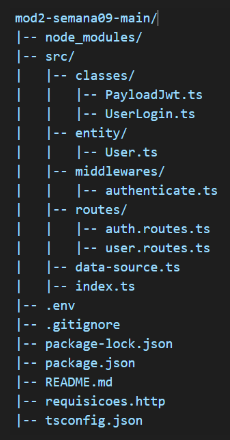

*Projeto Mod2-Semana09

**Descrição

Este é um projeto desenvolvido em TypeScript, estruturado para lidar com autenticação de usuários e gestão de dados. O projeto segue boas práticas de arquitetura e organização de arquivos.

**Tecnologias Utilizadas

- TypeScript
- Node.js
- Express.js
- TypeORM
- JSON Web Token (JWT)

** Estrutura do Projeto

* Diretórios e Arquivos Principais:
- classes/: Contém classes auxiliares para manipulação de JWT e login.
- entity/: Define a entidade User usada no banco de dados.
- middlewares/: Contém middleware de autenticação.
- routes/: Contém as rotas de autenticação e usuário.
- data-source.ts: Configuração da conexão com o banco de dados.
- index.ts: Ponto de entrada da aplicação.

* Instalação e Execução

1. Clone o repositório:
https://github.com/alexandrooliveira87/ProjetoAPISemana9.git

2. Instale as dependências:
npm install

3. Configure o arquivo .env conforme necessário.

4. Execute a aplicação:
npm run dev

* Endpoints Principais

- Autenticação: /auth
- Usuários: /users

* Contato
Caso tenha dúvidas ou sugestões, entre em contato pelo e-mail: alex.area1@gmail.com